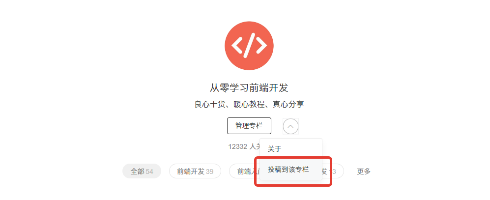

# 优秀英文技术文章翻译计划

[优秀英文技术文章翻译计划](https://github.com/discountry/wait-for-translate) 由 [从零学习前端开发](https://zhuanlan.zhihu.com/icode) 专栏发起。旨在为国内广大想要学习Web开发技术，但苦于获取不到优秀的技术文章资源，英文水平不足的同学们提供一个了解和学习技术的窗口和机会。

与此同时，参与翻译计划的译者可以锻炼提升自己的英文和阅读技术文档的水平，获得社区声望。

## 如何参与翻译计划

**[推荐英文技术文章](https://github.com/discountry/wait-for-translate/issues/new?title=文章推荐)**

1.认领翻译

在待翻译文章列表中的issues下回复，表面你想要翻译该文章的意愿。

2.翻译文章

独立完成该文章的翻译。我们推荐使用Markdown语法书写译文文档，在译文的开头，加上例如下方示例的声明：

> 原文链接：[What Every Frontend Developer Should Know About Webpage Rendering](http://frontendbabel.info/articles/webpage-rendering-101/)
> 
> 作者：(Alexander Skutin)[http://skutin.ru/]
> 
> 译者：余博伦
>
> 转载请注明出处。

编辑器推荐：

* [VS Code](https://code.visualstudio.com/) 安装 [Markdown All in One](https://marketplace.visualstudio.com/items?itemName=yzhang.markdown-all-in-one) 插件。
* [Sublime Text](https://www.sublimetext.com/) 安装 [Markdown​Editing](https://packagecontrol.io/packages/MarkdownEditing) 插件。

3.提交PR等待校对

在本repo中，打开文章相应分类的文件夹，将你的markdown文章拖拽至其中并上传，文档名称请与文章标题译名保持一致。

* [HTML](HTML/)
* [CSS](CSS/)
* [JavaScript](JS/)
* [Frameworks](Frameworks/)
* [Stories](Stories/)

上传完成后并确认提交后，会有是否提交pull request的提示，根据提示确定操作即可。之后只需等待校对，校对完成之后，在你之前申领翻译的相应issue下会有校对完毕的提醒。

4.发布文章到专栏

* 使用[markdown转换html工具](https://codepen.io/discountry/full/XKGJWp/)将校对完毕的文章转换成HTML文档，
* 复制粘贴至知乎专栏编辑器当中，
* 设置好文章标题及封面图片，
* 确认发布，
* 在[专栏主页](https://zhuanlan.zhihu.com/icode)将你的文章投稿至专栏等待审核。

